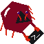

# Crab


CrabCLI (or just Crab) is a Crystal-lang framework/shard to make more beautifull Command Line Apps 

## Installation

1. Add the dependency to your `shard.yml`:

   ```yaml
   dependencies:
     crab:
       github: jaktondev/crab
   ```

2. Run `shards install`

## Usage

```crystal
require "crab"

width = Crab.get_cols

# You can use Crab.puts to print strings with "crab codes" for colors and styles
Crab.puts "Hello, #[light_blue, bg]#[green]World!"
Crab.puts "This is a test of the #[200,200,200,bg]Crab CLI shard."

# You can also use Crab.puts to print Crab::Renderable objects like panels, rules, prompts, and tables.
# Example of a panel
panely = Crab::Panel.new(width: 35, text: "This is a panel", title: "Test Pan", crab_codes: "#[orange]", box_crab_codes: "#[cyan]", vpos: "center", style: "ascii", hpos: "left")

Crab.puts panely

# Example of a rule
ruly = Crab::Rule.new(width: width, text: "Rule Tested", crab_codes: "#[red]#[light_grey,bg]", text_pos: "right")

Crab.puts ruly

# Example of a prompt
prompt = Crab::Prompt.new(text: "What is your name?", is_password: false, options: ["Jakton", "John", "Jane"], empty_allow: true)
name = prompt.ask # String

# Example of a number prompt
age_prompt = Crab::Promptn.new(text: "What is your age?", is_password: false, options: ["18", "20", "21"])
age = age_prompt.ask # Float 

# Example of a table
tably = Crab::Table.new(column_names: ["Name", "Age"], title: "Test Table", crab_codes: "#[light_blue]", box_crab_codes: "#[cyan]", header_crab_codes: "#[light_grey,bg]", style: "ascii")
tably.padd_row(["Jakton", 999])
tably.padd_row([name, age])

Crab.puts tably

# There is also a way to do progress bars
progress = Crab::Progress.new
bar1 = Crab::Bar.new(width: 50, text: "Loading", total: 100, current: 0, color: "orange")
bar2 = Crab::Bar.new(width: 50, text: "Processing", total: 100, current: 0, color: "green")
progress.add_bar(bar1)
progress.add_bar(bar2)
progress.puts "Progress Example" # This will print the progress bars and a message above them
bar1.current = 50 # Update the current value of the first bar
bar2.current = 25 # Update the current value of the second bar
progress.update # This will update the progress bars
  
```

Right now there is a way of printing/puts strings with "crab codes" some pieces of strings with similar syntax to Crystal's string interpolation. As seen on the example above
- `#[color]` for colors, `#[color,bg]` for background colors, `#[r,g,b]` for RGB colors, `#[r,g,b,bg]` for RGB background colors.
- You can change the color mode with Crab.change_color_mode(mode) where mode can be "full", "256", "8" or any other string for black and white mode. Default is "256".

Available colors:
- 'black', 'red', 'green', 'yellow', 'blue', 'magenta', 'cyan', 'white', 'orange', 'green', 'purple', 'brown', 'gray', 'light_gray', (both spellings (grey)), 'light_red', 'light_green', 'light_yellow', 'light_blue', 'light_magenta', 'light_cyan', 'light_orange', 'light_purple', 'light_brown' and 'default' for terminal default color.


## Development

I will try to update, fix and add new features to Crab as much as I can, but I'm still a student and I have other projects to work on, so please be patient. :p

## Contributing

If possible contact me first, if not you are free to create branches and pull requests.

## Contributors

- [jaktondev](https://github.com/jaktondev) - creator and maintainer
